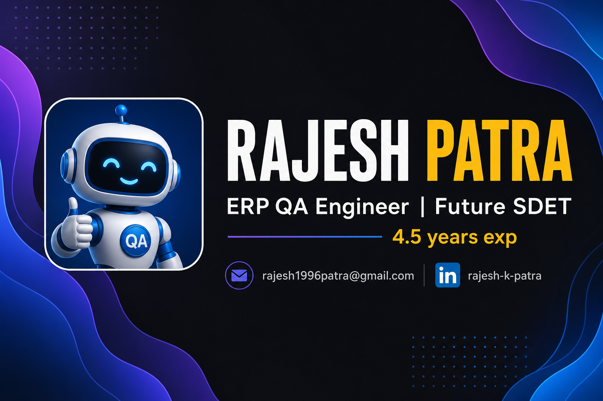

  

# Hi there, I'm [Rajesh](https://github.com/Rk-Staging) 👋

  I'm a <b>Senior Software Engineer</b> | <b>ERP QA Engineer</b> | <b>Future SDET</b> 🧪, focused on ERP & SAP workflows 📊, API testing 🔌, and building automation with <b>Playwright + TypeScript</b> 🚀

---

## 🤝 Connect with me:

  
  

---

## 🏅 Achievements & Expertise

  
  
  
  
  
  

  💭 If you have any questions or feedback, please don't hesitate to reach out to me!

---

## 🔭 I'm currently working on

- 🏗️ **ERP Automation Framework** — Playwright + TypeScript  
- 🔌 **API Testing Framework** — Postman & Newman-ready collections  
- 🔄 **SAP Integration Testing** — cross-system validation  
- 📦 **Procurement Workflow Validation** — PR → PO → GR  
- 🧾 **Invoice OCR Validation** — accuracy & field mapping checks  

---

## 🛠️ Tech Stack

---

## 📚 Current Learning Journey

| | Skill | Status |
|---|--------|--------|
| ✅ | Manual & API Testing | Completed |
| 🔄 | Playwright + TypeScript | In progress |
| ⏳ | Automation Frameworks | Learning |
| ⏳ | CI/CD & GitHub Actions | Up next |

---

## 📊 GitHub Stats

  
  

  

---

  <i>Portfolio — coming soon</i> · <b>Thanks for visiting!</b> 🙏

