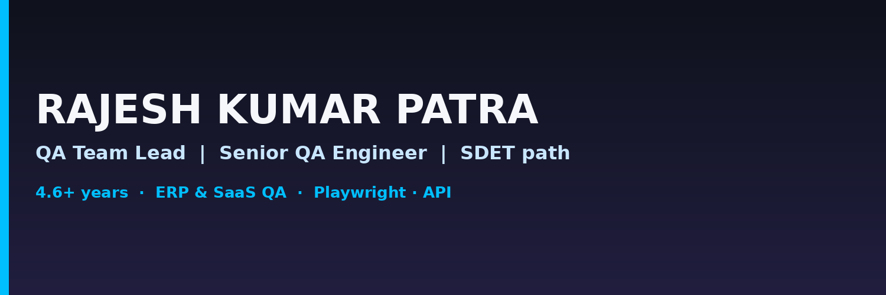

  

# Hi there, I'm [Rajesh](https://github.com/Rk-Staging) 👋

<b>QA Team Lead</b> | <b>Senior QA Engineer</b> | <b>4.6+ years</b> | <b>ERP & SaaS QA</b>

I lead quality across ERP and SaaS workflows with Playwright automation, API testing, and an SDET-focused path.

## About me

- QA Team Lead with **4.6+ years of experience** in ERP and SaaS quality engineering
- Focused on functional, integration, regression, and API testing
- Building practical automation with Playwright, TypeScript, and test strategy
- Experienced with ERP, SAP, procurement, invoice, and OCR workflows

## Tools & technologies

   

## Connect with me

<a href="https://www.linkedin.com/in/rajesh-k-patra/">LinkedIn</a> · <a href="mailto:rajesh1996patra@gmail.com">Email</a> · <a href="https://rk-staging.github.io/portfolio/">Portfolio</a>

